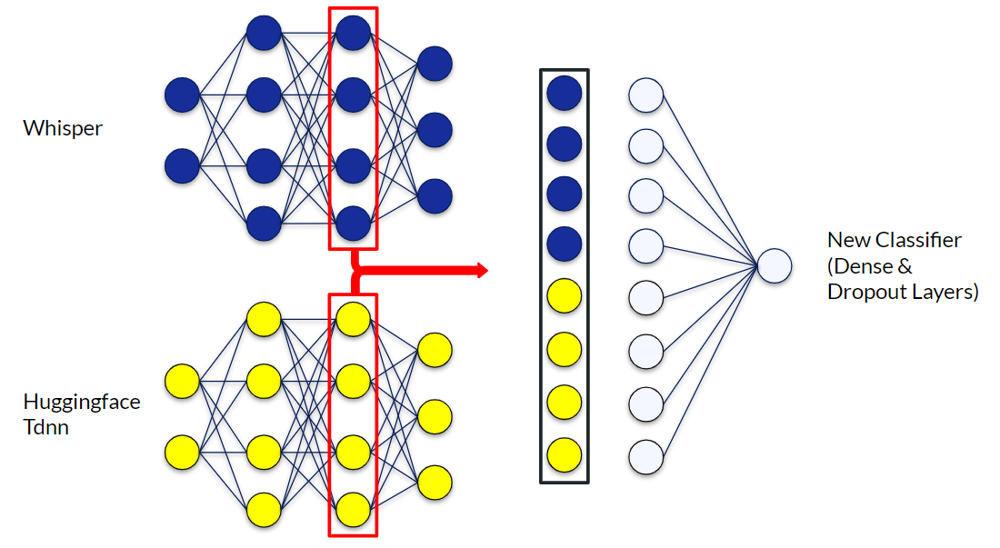
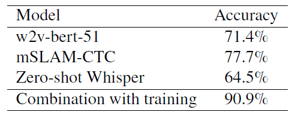

# Language Identification

## Contents
1. Introduction
2. Method
3. Results
4. Notebooks

## 1. Introduction
This project provides notebooks to replicate improvements in language identification from audio (recognizing which language is being spoken). These improvements over current methods were achieved by combining existing models and training an additional classifier.

 

For example, improved language identification accuracy would enable chatbots at train stations or airports with the purpose of answering questions for a wide variety of people in different languages as software that reliably identifies the spoken language is necessary for a simple and successful verbal communication between the chatbot and the users.

## 2. Method
The method which has been used to enhance the current language identification models was to train a new model which essentially uses the existing models as embedding layers. Within this approach, the already existing models were used as a basis to extract relevant information from the audio files while a newly trained model was built on top of them, only representing the last layers in order to perform the final classification.

 

Essentially, the approach utilizes a combination of the penultimate layers of whisper and a tdnn model from Hugging Face by taking the output vectors of the penultimate layers of the models, combining them, and using these combined vectors from each audio file as input vectors for the new model which is to be trained. For training, validation and testing, the corresponding audio files from the FLEURS training, development and test dataset are to be used. Using this approach, the penultimate layers of the two models are essentially combined. Instead of the output layers of each model, the newly trained model acts as an output layer which can classify a combined input vector.

## 3. Results
For the development of this approach, the complete FLEURS dataset, containing 102 languages, has been used. In the training process of this newly trained model, the FLEURS train and development datasets have been used. For the evaluation of this approach, the FLEURS test dataset has been used. The results of this evaluation and a comparison to existing models can be seen below.

## 4. Notebooks
The code for the replication of the method and it's results is split into four different jupyter notebooks in the "notebooks"-folder. 

 

- The first notebook ("1._FLEURS_download.ipynb") can be used to download the FLEURS data set necessary for training and evaluation of the model.
- The second notebook ("2._Tensor_creation.ipynb") can be used to create the tensors for the training and evaluation of the model, essentially preprocessing the audio files using the two existing models.
- The third notebook ("3._Dataset_creation.ipynb") can be used to combine the previously created vectors into training, validation and test data sets.
- The fourth notebook ("4._Training_and_evaluation.ipynb") can be used to train and evaluate the additional model.
